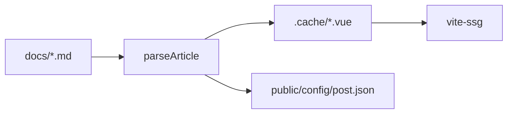

# 测试文档

用于验证 KruDocs 的编译与渲染链路是否正常工作：正文 SFC 生成、代码高亮、提示块、表格、任务列表、mermaid、公式、上下篇。

## 标题锚点

鼠标悬停在标题上应出现锚点链接。

## 代码高亮

```js
const greet = (name) => `hello, ${name}`
console.log(greet('krudoc'))
```

```python
def fib(n: int) -> int:
    return n if n < 2 else fib(n - 1) + fib(n - 2)
```

## 表格

| 能力 | 插件 | 状态 |
| --- | --- | --- |
| 代码高亮 | shiki | 编译期 |
| 提示块 | @mdit/plugin-container | 编译期 |
| 公式 | @mdit/plugin-katex | 编译期 |
| 图形 | mermaid | 运行期 |

## 提示块

:::tip 提示
这是一个 tip 提示块。
:::

:::warn 警告
这是一个 warn 提示块。
:::

## 任务列表

- [x] 修复 tsconfig 别名
- [x] 编译脚本兜底
- [ ] 全量侧栏配置

## Mermaid



## 公式

行内公式 $E = mc^2$ 应正常渲染。

块级公式：

$$
\int_{0}^{1} x^2 \, dx = \frac{1}{3}
$$

## 上下篇

本文被配置在侧栏首位，应只有 next、没有 prev。
